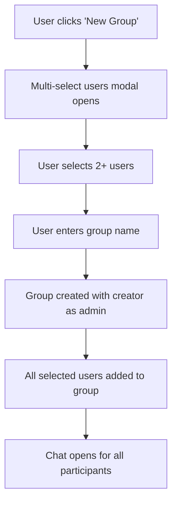
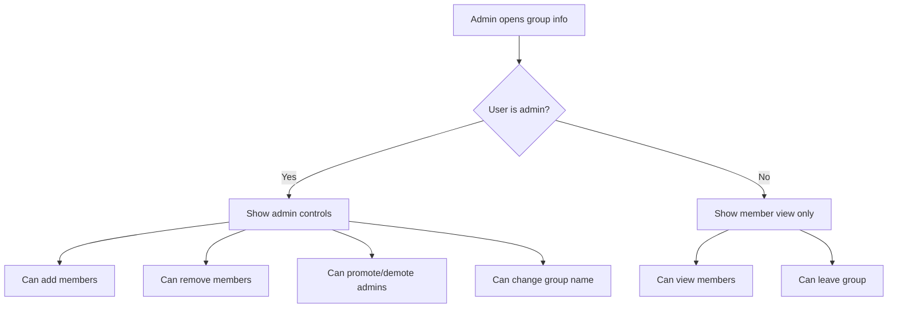
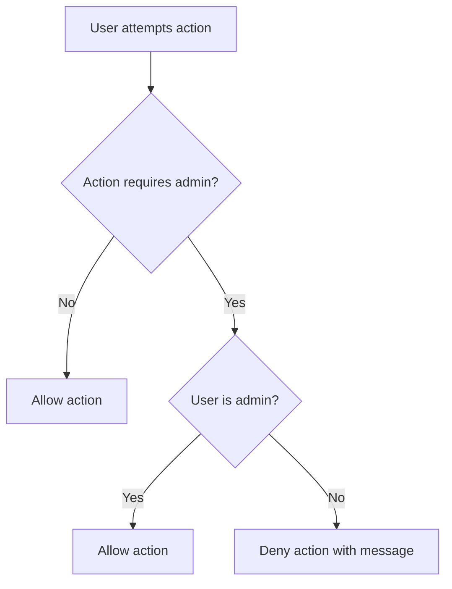
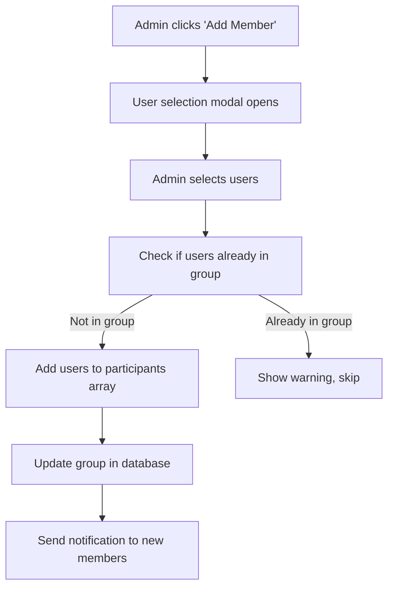

# Group Chat User Flows

## Group Creation Flow


## Group Management Flow


## Permission Check Flow


## Member Addition Flow


## Member Removal Flow
```mermaid
graph TD
    A[Admin selects member to remove] --> B{Target is admin?}
    B -->|Yes| C{Only admin?}
    C -->|Yes| D[Cannot remove - show error]
    C -->|No| E[Allow removal]
    B -->|No| E

    E --> F{Target is self?}
    F -->|Yes| G[Confirm leaving group]
    F -->|No| H[Confirm removing member]

    G --> I[Remove from group]
    H --> I
    I --> J[Update database]
    J --> K[Notify remaining members]